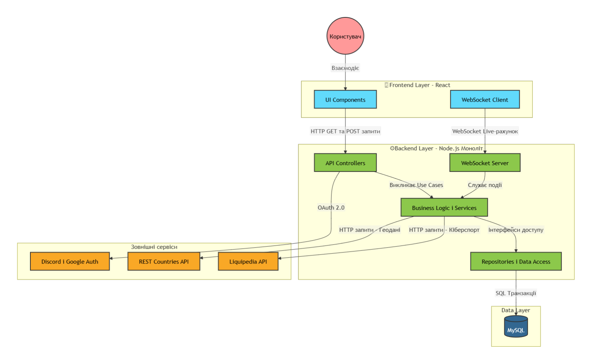

# Документ SAD-001: Internal View

**Статус:** Accepted  
**Дата:** 07.04.2026  
**Проєкт:** EsportHub  

**Description:**

### 1. Аналіз логіки та структури (Input)
* **Складність бізнес-правил:** Висока. Проєкт передбачає складну логіку агрегації геоданих для інтерактивної мапи, парсинг кіберспортивних статей та забезпечення миттєвих Live-оновлень матчів (згідно з NFR-01). Це вимагає чіткої ізоляції бізнес-логіки від коду бази даних і мережевих протоколів.
* **Джерела даних:** Основне сховище — реляційна БД (PostgreSQL) для забезпечення структурованого збереження профілів, турнірів та надійної роботи індексів для надшвидкого пошуку гравців (NFR-06).
* **Зовнішні залежності:** Дуже високі. Проєкт критично залежить від зовнішніх API (Liquipedia для кіберспортивних даних, REST Countries для мапи) та сторонніх провайдерів авторизації (Discord OAuth, Google Auth).

### 2. Вибір патерну
**Обраний патерн:** Clean Architecture (Чиста архітектура).  
**Чому:** На відміну від стандартної Layered Architecture, Clean Architecture дозволяє ізолювати «серце» EsportHub (логіку формування інтерактивної мапи та агрегації статистики) від зовнішніх API та фреймворків. Якщо Liquipedia змінить формат відповідей або ми вирішимо підключити інше джерело даних, нам доведеться змінити лише код у шарі `Infrastructure`, не чіпаючи бізнес-логіку системи. Це також спрощує написання unit-тестів.

### 3. Визначення відповідальності шарів (Layers)

| Шар | Назва (в проєкті) | Відповідальність та компоненти |
| :--- | :--- | :--- |
| **Presentation Layer** | API / Web | Приймає HTTP та WebSocket запити. Містить `Controllers`, легкі `DTOs` (для швидкого рендеру мапи згідно з NFR-02) та `Middlewares` (валідація токенів). Не містить логіки обчислень. |
| **Application Layer** | Business Logic / Services | Реалізує конкретні сценарії (Use Cases): «Завантажити мапу», «Оновити рахунок», «Знайти профіль». Використовує інтерфейси репозиторіїв та сторонніх адаптерів. |
| **Domain Layer** | Core / Entities | Найвищий рівень абстракції. Містить `Entities` (`Player`, `Match`, `Team`, `MapMarker`) та базові правила домену. |
| **Infrastructure Layer**| Persistence / External | Реалізація доступу до БД через `Repositories` (ORM). Імплементація підключення до сторонніх API (Liquipedia, REST Countries, Discord) та реалізація WebSocket-з'єднання. |

### 4. Схема залежностей

